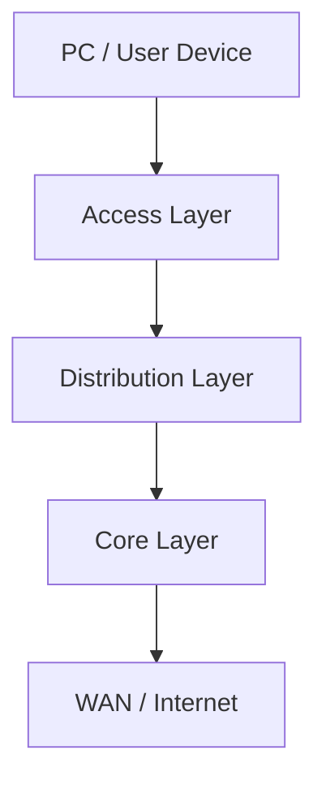
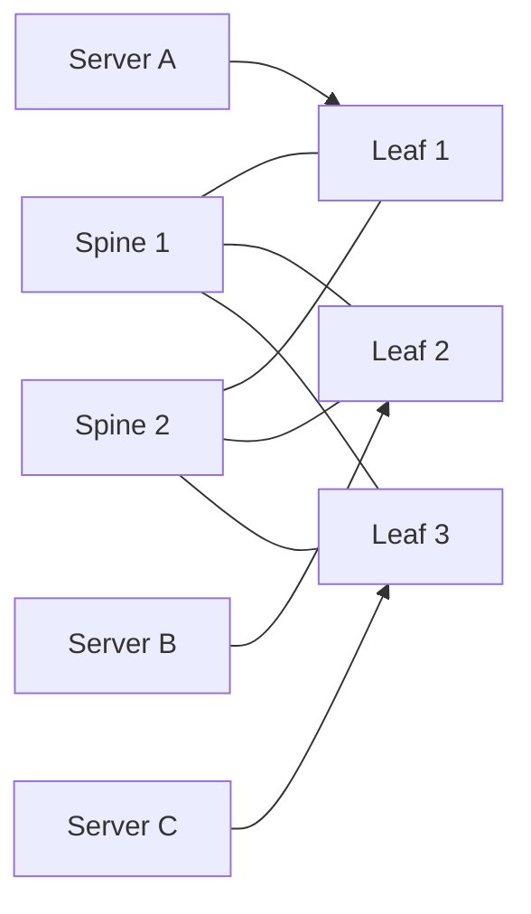
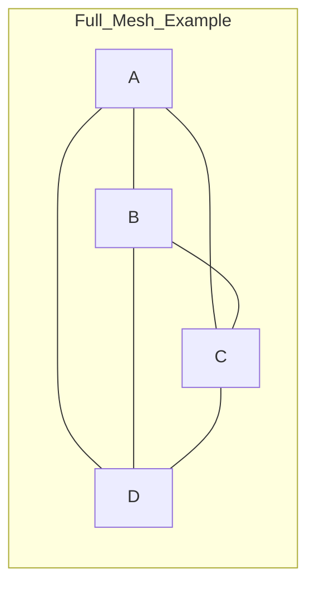
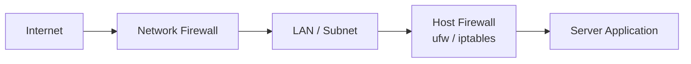
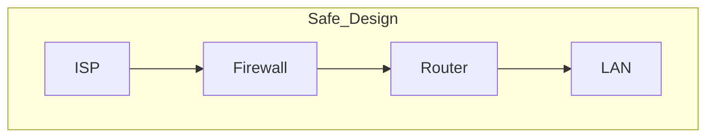
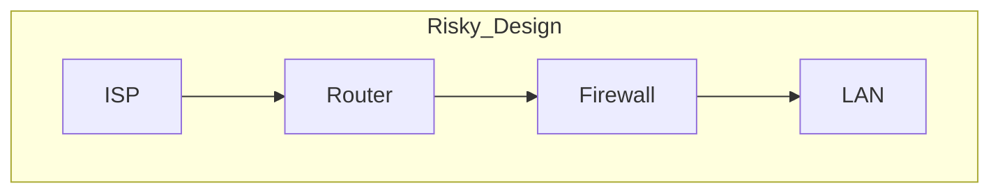

# Report Lab Network Security

## By Students

- Benhamada Hocine Ramzi 212231542006
- yhaioui Abderrahmane 222231485201

## Question 1

What is the difference between these network architectures?

### 1) 3-Tier Architecture

Traditional enterprise design with 3 layers:

- Core Layer: high-speed backbone (mainly fast forwarding).
- Distribution Layer: routing, ACL policies, VLAN routing/filtering.
- Access Layer: where end devices connect (PCs, printers, APs).

Advantages:
- Scalable for campus networks.
- Easy to manage because each layer has a clear role.
- Good separation between user edge and backbone.

Disadvantages:
- More hardware cost (multiple switch layers).
- Can add latency compared to modern flat designs.
- East-west traffic is not always optimal.

Examples:
- University campus network.
- Large office with many buildings/floors.

Quick data:
- Inter-building traffic can pass multiple layers.
- In many designs, path can be around 3 to 5 network hops depending on source/destination.

### 2) Spine-Leaf Architecture

Modern data center architecture:

- Spine switches: backbone.
- Leaf switches: connect servers.
- Every leaf connects to every spine.

Advantages:
- Low and predictable latency.
- High bandwidth for east-west traffic.
- Scales horizontally by adding more leaf/spine switches.

Disadvantages:
- Cost can be high (many links + high-speed ports).
- Fabric design/operations can be complex.

Examples:
- Cloud/data center environments.
- Virtualization and container platforms.

Quick data:
- Typical server-to-server path in same fabric is often 2 L3 hops (leaf -> spine -> leaf).
- Link count in fabric is usually: number_of_leafs x number_of_spines.

### 3) Mesh Architecture

Devices are interconnected.

- Full mesh: every node connects to every other node.
- Partial mesh: only some nodes are fully interconnected.

Advantages:
- High redundancy (very resilient, no single path dependency).
- Reliable when link/node failures happen.

Disadvantages:
- Very expensive for full mesh.
- Hard to manage at large scale.

Examples:
- WAN between critical branch sites.
- Small resilient backbone with few core nodes.

Quick data:
- Full mesh link formula: n(n-1)/2.
- Example: 10 nodes need 45 direct links (full mesh).

Simple comparison:
- 3-Tier: strong for enterprise campus and north-south traffic.
- Spine-Leaf: strong for data center and east-west traffic.
- Mesh: strongest redundancy, but cost/complexity grows fast.

## Question 2

Difference between host-based firewall and network-based firewall

### Host-Based Firewall

Installed on one device (PC/server).

Examples:
- Windows Defender Firewall.
- Linux iptables / nftables / ufw.

Pros:
- Protects each machine directly.
- Fine-grained control by app/process/port.

Cons:
- Hard to manage at scale (many hosts).
- Depends on endpoint integrity and local admin hygiene.

### Network-Based Firewall

Placed in the network path (edge, gateway, or segmentation point).

Examples:
- Cisco ASA.
- Fortinet FortiGate.
- Palo Alto, cloud firewalls (AWS/Azure/GCP).

Pros:
- Centralized protection.
- Protects full subnet/network segments.

Cons:
- Less visibility into host-local traffic.
- Limited visibility for encrypted payload without decryption features.
- Can become single point of failure if badly designed.

Important logic point:
- Host firewall filters in the host OS stack before traffic reaches the app.
- Network firewall filters before traffic enters/leaves a network zone.

Key difference table:

| Feature | Host-Based | Network-Based |
|---|---|---|
| Location | On device | On network edge/gateway |
| Scope | One machine | Entire network/subnet |
| Control style | Detailed (apps/processes) | Traffic flow/policy zones |
| Management | Hard at large scale | Centralized |

Quick data:
- If you have 200 servers, host firewall policy work can mean 200 local policy sets.
- With network firewall, one policy platform can cover many segments.

Note:
Host firewall can be affected by local process behavior.
Example: Docker may publish a service on 0.0.0.0 if not configured carefully.
Network firewall helps reduce this risk by filtering before hosts receive traffic.

Best practice:
Use both together (defense in depth), not only one.

## Question 3

What is better:
ISP -> Firewall -> Router -> LAN
or
ISP -> Router -> Firewall -> LAN

Best and safer design is:
ISP -> Firewall -> Router -> LAN

Reason:
If router is directly exposed to ISP, router admin panel/SSH/services can be reachable from internet before firewall rules apply.

In short:
- Firewall first = better protection for router and internal network.
- Router first = more exposure and higher attack surface.

If router and firewall are in the same device (common in home routers), this comparison is different.
But when they are separate devices, firewall-first is usually the safer design.

Extra note (logic):
Firewall-first improves filtering and exposure control, but very large DDoS can still saturate the internet link before traffic reaches your firewall.